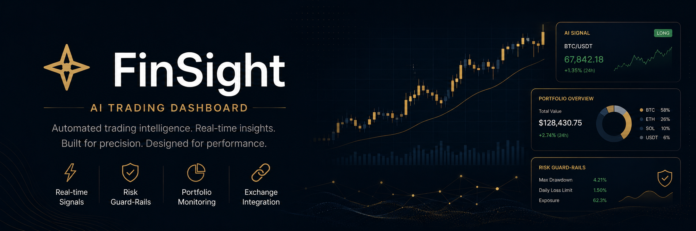
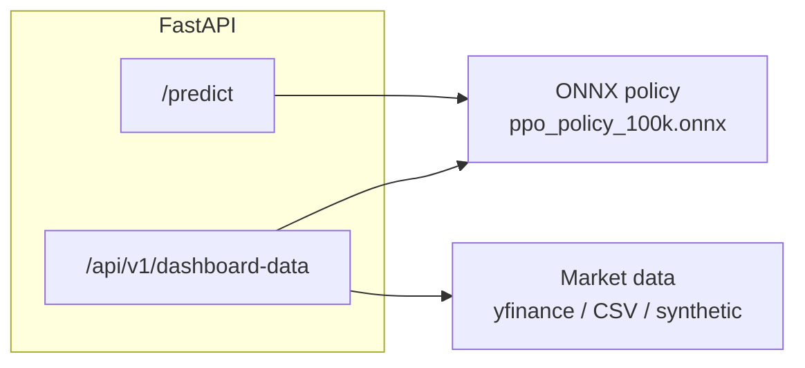
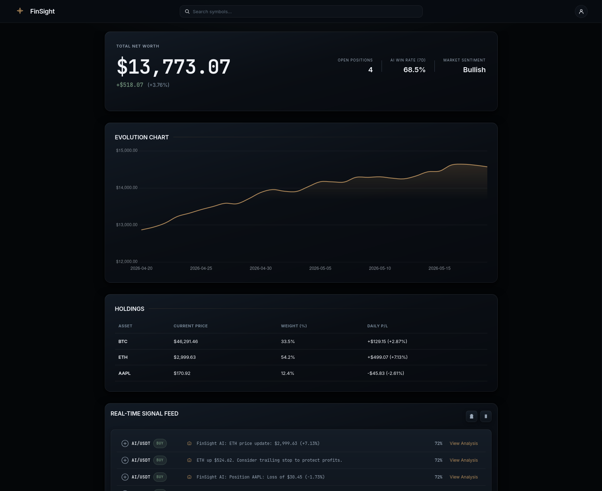
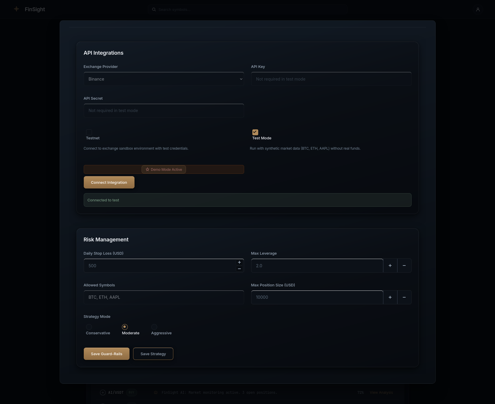

<!-- Canonical repository: https://github.com/sidnei-almeida/deep-rl-trading-agent -->
<p align="center">
  
</p>

<h1 align="center">deep-rl-trading-agent</h1>

<p align="center">
  <strong>FastAPI service serving a PPO reinforcement-learning trading policy as ONNX on CPU, plus a dashboard backtest endpoint with Buy&nbsp;&amp;&nbsp;Hold benchmark and live-quality price data (yfinance with fallbacks).</strong>
</p>

<p align="center">
  
  
  
  
</p>

<p align="center">
  <a href="#overview">Overview</a> ·
  <a href="#gallery">Gallery</a> ·
  <a href="#features">Features</a> ·
  <a href="#observation--action-space">Observation / action</a> ·
  <a href="#api-reference">API</a> ·
  <a href="#installation-and-quick-start">Quick start</a> ·
  <a href="#deployment">Deploy</a> ·
  <a href="#project-layout">Layout</a> ·
  <a href="#disclaimer">Disclaimer</a> ·
  <a href="#author">Author</a>
</p>

---

## Overview

**deep-rl-trading-agent** packages a **Proximal Policy Optimization (PPO)** policy trained in a custom trading environment (see `notebooks/03_Model_Training_and_Evaluation.ipynb`), exported to **`ppo_trader_onnx/ppo_policy_100k.onnx`**, and served with **ONNX Runtime** (CPU). The API returns **raw logits** and **softmax portfolio weights** over **five** liquid names: **AAPL, MSFT, GOOGL, AMZN, NVDA**.

| Piece | Role |
|-------|------|
| **`/predict`** | Single-step inference from an 11-dimensional observation. |
| **`/api/v1/dashboard-data`** | Historical prices (yfinance → CSV → synthetic), **Buy & Hold** curve, and **agent backtest** time series for charts. |
| **Training artifacts** | Notebooks under `notebooks/`; weights committed as ONNX in `ppo_trader_onnx/`. |



---

## Gallery

<p align="center">
  <table>
    <tr>
      <td align="center" valign="top">
        
      </td>
      <td align="center" valign="top">
        
      </td>
    </tr>
  </table>
</p>

<p align="center">
  <em><strong>Figure 1.</strong> Left: primary UI or dashboard. Right: secondary view (metrics, backtest, or docs)—update <code>images/software1.png</code> / <code>software2.png</code> as needed.</em>
</p>

---

## Features

| Area | Description |
|------|-------------|
| **CPU inference** | `onnxruntime` with `CPUExecutionProvider` only—no GPU required for serving. |
| **Strict validation** | `POST /predict` rejects observations unless `len(observation) == 11`. |
| **Data resilience** | `fetch_price_data()` tries **yfinance**, then **`data_fallback/sp500.csv`**, then a **deterministic synthetic** series. |
| **CORS** | Open by default (`*`); tighten `allow_origins` for production. |
| **Render-ready** | `render.yaml` with Uvicorn bound to `$PORT`. |

---

## Observation & action space

**Observation** (length **11**):

| Indices | Meaning |
|---------|---------|
| `0` | Cash balance |
| `1–5` | Shares owned (one per ticker) |
| `6–10` | Current prices for the five assets |

**Response** from `/predict`:

- **`raw_action`** — policy logits (length 5).
- **`allocations`** — **softmax(raw_action)**; interpret as portfolio weights (sum ≈ 1).

---

## API reference

| Method | Path | Description |
|--------|------|-------------|
| `GET` | `/` | Health JSON: `status`, `model_loaded`. |
| `POST` | `/predict` | Body: `{ "observation": [ ... 11 floats ... ] }` → `raw_action`, `allocations`. |
| `GET` | `/api/v1/dashboard-data` | JSON bundle: `tickers`, `data_source`, `agent_history`, `benchmark_history`, `price_history`, `current_allocation`, etc. |

Interactive docs: **`/docs`**, **`/redoc`**.

**Example**

```bash
curl -s -X POST "http://localhost:8000/predict" \
  -H "Content-Type: application/json" \
  -d '{"observation": [100000,0,0,0,0,0,500,3000,150,350,700]}' | jq .
```

---

## Installation and quick start

```bash
git clone https://github.com/sidnei-almeida/deep-rl-trading-agent.git
cd deep-rl-trading-agent
python -m venv .venv
source .venv/bin/activate   # Windows: .venv\Scripts\activate
pip install -r requirements.txt
uvicorn app:app --reload --host 0.0.0.0 --port 8000
```

Open **`http://localhost:8000/docs`**.

---

## Deployment

`render.yaml` defines a **Python Web Service**:

- **Build:** `pip install -r requirements.txt`
- **Start:** `uvicorn app:app --host 0.0.0.0 --port $PORT`
- **Python:** `3.11.8` via `PYTHON_VERSION`

Ensure **`ppo_trader_onnx/ppo_policy_100k.onnx`** is in the repo for the service to report `model_loaded: true`.

---

## Project layout

```
deep-rl-trading-agent/
├── app.py
├── requirements.txt
├── runtime.txt
├── render.yaml
├── ppo_trader_onnx/
│   └── ppo_policy_100k.onnx
├── data_fallback/
│   └── sp500.csv
├── images/
│   ├── header.png
│   ├── software1.png
│   └── software2.png
└── notebooks/
    ├── 01_Data_Acquisition_and_Analysis.ipynb
    └── 03_Model_Training_and_Evaluation.ipynb
```

---

## Disclaimer

This software is for **research and education**. Markets are risky; the PPO policy is a snapshot trained on historical patterns. **Not financial advice.** Add authentication, rate limits, and monitoring before any real-money use.

---

## Author

| | |
| --- | --- |
| **Maintainer** | [Sidnei Almeida](https://github.com/sidnei-almeida) |
| **Repository** | [github.com/sidnei-almeida/deep-rl-trading-agent](https://github.com/sidnei-almeida/deep-rl-trading-agent) |

---

<p align="center">
  <sub>Training used <b>stable-baselines3</b>-style workflows in notebooks; runtime depends only on ONNX + FastAPI.</sub>
</p>
